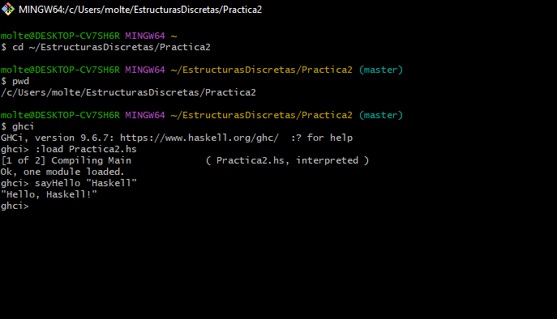

# Práctica 02 – Introducción a Haskell  
Facultad de Ciencias – UNAM  
Estructuras Discretas 2026-II  

## Objetivo

El objetivo de esta práctica es familiarizarse con el uso del intérprete ghci, 
la creación de archivos .hs y la implementación de funciones básicas en Haskell 
utilizando tipos de datos como enteros, flotantes, booleanos, tuplas y listas.

También se trabajó con operaciones aritméticas, condicionales, concatenación 
de cadenas, operaciones bitwise y comprensión de listas.

---

## Tiempo requerido

Aproximadamente 3–4 horas. (eso fue lo que yo use jaja)

---

## Ejercicio 1

Se abrió la terminal, se accedió a la carpeta Practica2 y se cargó el archivo 
Practica2.hs utilizando ghci.  

Se ejecutaron funciones para comprobar su correcto funcionamiento.

---

## Explicación de esPar

Para determinar si un número es par se utilizó una operación bitwise:

En binario, los números pares terminan en 0 y los impares en 1.  
Al hacer una operación AND con 1, se obtiene:

- 0 → número par  
- 1 → número impar  

Si el resultado es 0, el número es par.

No se utilizó `mod` ni recursión, como lo indicaban las restricciones.

---

## ¿Por qué no se puede usar el operador lógico && en esPar?

El operador `&&` trabaja únicamente con valores booleanos (True o False).  
En este ejercicio se necesitaba trabajar con bits a nivel binario, por lo que 
se utilizó el operador bitwise `. & .` del módulo Data.Bits, que opera directamente 
sobre los bits de un número entero.

---

## Comentarios finales

Durante la práctica se reforzó el uso de tipos, funciones puras, condicionales 
y manipulación de datos en Haskell, así como el uso del repositorio Git para 
el control de versiones.
