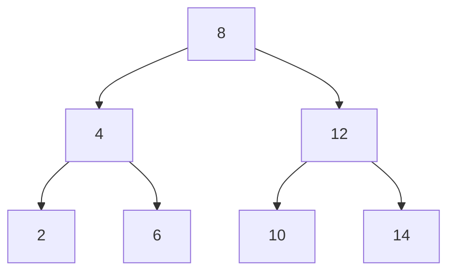
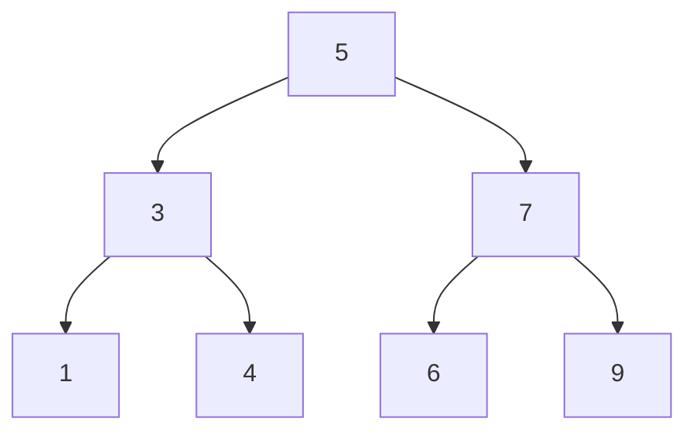
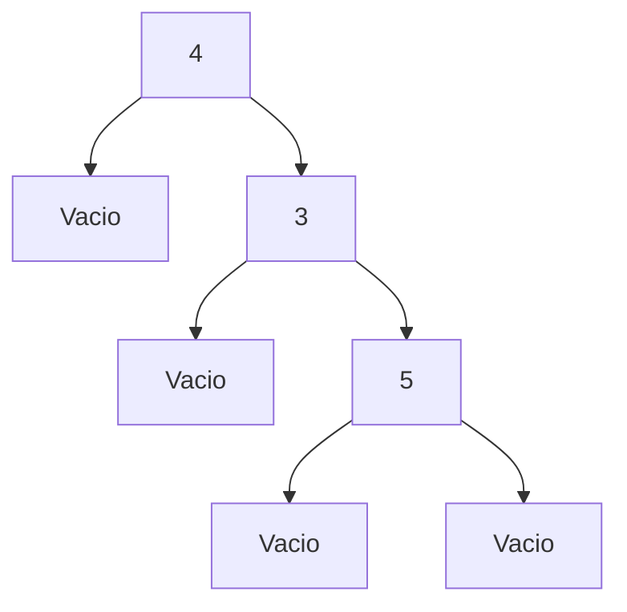
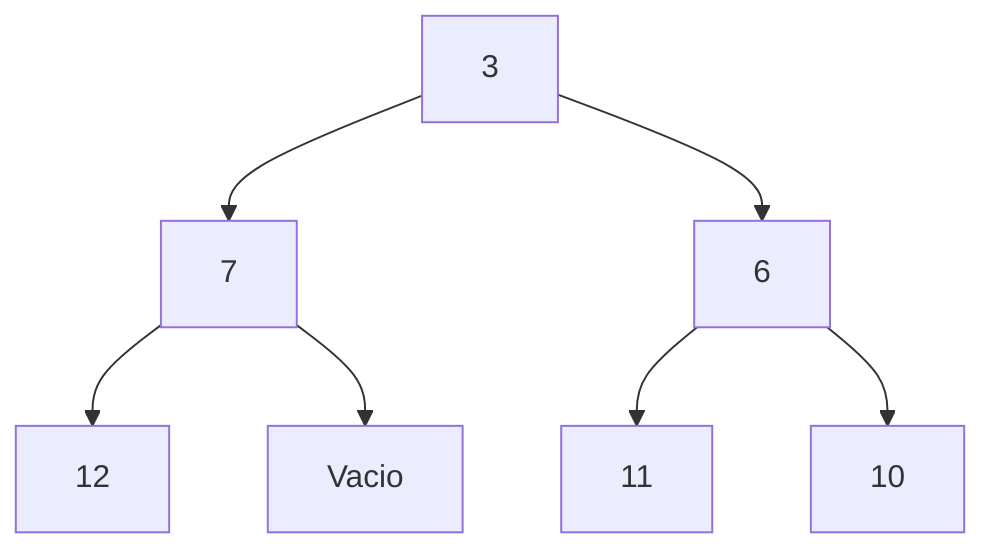
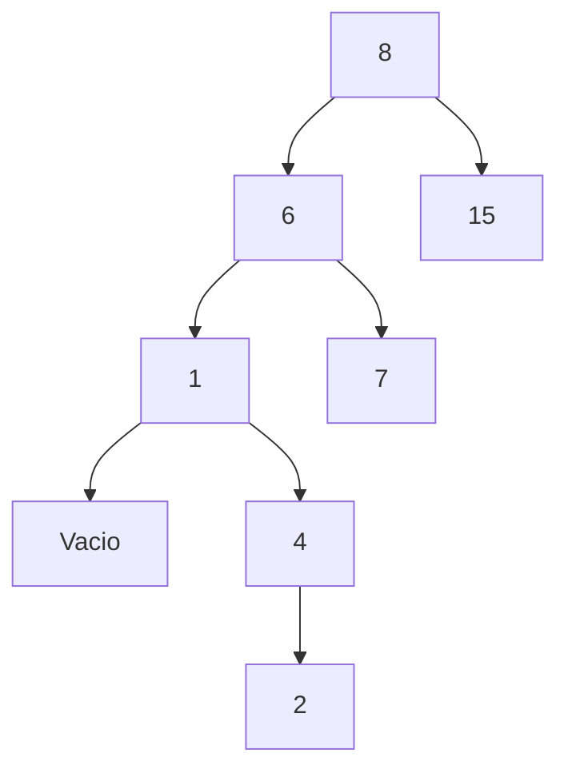

# Práctica 06: Árboles Binarios

## 📌 Objetivo

Implementar y manipular árboles binarios en Haskell, comprendiendo su estructura recursiva, recorridos, balanceo y construcción como árboles binarios de búsqueda (BST).

---

## ⏱️ Tiempo estimado

6–8 horas.

---

## 🌳 Tipo de dato utilizado

```haskell
data Arbol a = Vacio | AB a (Arbol a) (Arbol a) deriving (Eq, Ord, Show)
```

---

## 🌐 Representaciones gráficas con Mermaid

### Árbol 1



---

### Árbol 2



---

## 🌳 Representación de árboles dados

### a)



---

### b)



---

### c)



---


❓ Preguntas teóricas
• ¿De acuerdo al ejemplo de foldl o foldr, el árbol resultante es un BST balanceado?

No necesariamente.

El uso de foldl o foldr para construir un árbol binario de búsqueda depende del orden de los elementos en la lista. Si los elementos se insertan en un orden desfavorable (por ejemplo, una lista ya ordenada), el árbol resultante se vuelve degenerado (similar a una lista), por lo que no estará balanceado.

En general, ni foldl ni foldr garantizan por sí mismos que el árbol sea balanceado.

• ¿Cuál sería la idea para que foldl o foldr nos ayuden a insertar BST balanceados?

Conceptualmente, la clave no está en foldl o foldr, sino en el orden en el que se insertan los elementos.

Para obtener un árbol balanceado, se puede:

Insertar primero el elemento medio de la lista
Luego insertar recursivamente las medianas de las sublistas izquierda y derecha

Es decir, construir el árbol siguiendo una estrategia tipo “divide y vencerás”, similar a cómo se construye un árbol balanceado a partir de una lista ordenada.

• ¿Cuáles son las ventajas de foldl sobre foldr?
Es más eficiente en muchos casos cuando se trabaja con evaluación estricta
Puede usar menos memoria si se evalúa de forma estricta (foldl')
Es más natural cuando se quiere acumular resultados de izquierda a derecha
• ¿Cuáles son las ventajas de foldr sobre foldl?
Funciona mejor con listas infinitas gracias a la evaluación perezosa
Permite producir resultados parciales sin recorrer toda la lista
Es más adecuado para construir estructuras recursivas como árboles o listas
🧠 Conclusión

El balanceo de un árbol no depende de usar foldl o foldr, sino del orden en que se insertan los elementos. Ambas funciones son herramientas útiles, pero el control de la estructura del árbol requiere una estrategia adicional.

## ⚙️ Implementación

Las funciones fueron implementadas de manera recursiva respetando las restricciones de la práctica (sin uso de `foldr`, `foldl`, `maximum` o `minimum`).

Se desarrollaron funciones para:

* Recorridos del árbol (InOrden, PreOrden, PosOrden)
* Verificación de balanceo
* Construcción de árboles binarios de búsqueda (BST)

---

## 📊 Observaciones

* El comportamiento del árbol depende del orden de los elementos en la lista.
* Si la lista **no está ordenada**, el árbol puede quedar desbalanceado.
* Si la lista **está ordenada**, el árbol se degenera en una estructura lineal.
* La recursión es clave para trabajar con estructuras de tipo árbol.

---

## 📁 Estructura del proyecto

```
Practica6/
│── Practica6.hs
│── Auxiliar.hs
│── README.md
│── LICENSE
```

---

## 📜 Licencia

Se utilizó la licencia MIT, la cual permite el uso, copia y modificación del software de manera libre.

---

## 🧾 Notas adicionales

* Todas las funciones fueron documentadas.
* Se realizaron pruebas unitarias con HUnit.
* Se respetaron todos los lineamientos de la práctica.
